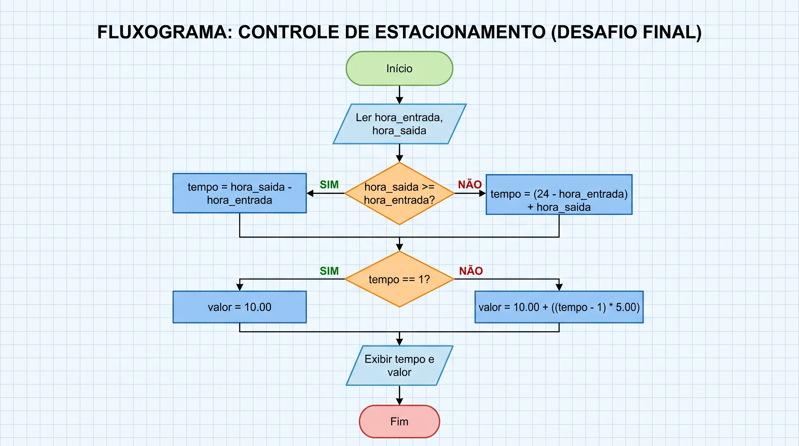

# Desafio Final: Controle de Estacionamento

## 1. Descrição do Problema
Um estacionamento cobra R$ 10,00 pela primeira hora e R$ 5,00 por hora adicional. O sistema precisa calcular o valor a pagar com base na hora de entrada e saída, lidando inclusive com veículos que entram em um dia e saem na madrugada do dia seguinte (formato 24h).

-----------------

## 2. Entradas Necessárias
- `hora_entrada` (Número Inteiro)
- `hora_saida` (Número Inteiro)

-------------------

## 3. Processamento
- Se `hora_saida >= hora_entrada`: `tempo = hora_saida - hora_entrada`
- Se `hora_saida < hora_entrada` (virou a noite): `tempo = (24 - hora_entrada) + hora_saida`
- Se `tempo == 1`: o `valor` devido é R$ 10,00.
- Se `tempo > 1`: o `valor` devido é R$ 10,00 + `(tempo - 1) * 5,00`.

-----------------

## 4. Saídas Esperadas
- Tempo total de permanência (em horas).
- Valor total a pagar.

----------------

## 5. Pseudocódigo Completo
```text
INICIO
   LEIA hora_entrada
   LEIA hora_saida

   SE hora_saida >= hora_entrada ENTAO
      tempo <- hora_saida - hora_entrada
   SENAO
      tempo <- (24 - hora_entrada) + hora_saida
   FIM_SE

   SE tempo == 1 ENTAO
      valor <- 10.00
   SENAO
      valor <- 10.00 + ((tempo - 1) * 5.00)
   FIM_SE

   ESCREVA "Tempo de permanência: ", tempo, "h"
   ESCREVA "Valor a pagar: R$ ", valor
FIM
```

## 6. Fluxograma de código.

graph TD
    A([Início]) --> B[/Ler hora_entrada, hora_saida/]
    B --> C{hora_saida >= hora_entrada?}
    C -- Sim --> D[tempo = hora_saida - hora_entrada]
    C -- Não --> E[tempo = 24 - hora_entrada + hora_saida]
    D --> F{tempo == 1?}
    E --> F
    F -- Sim --> G[valor = 10.00]
    F -- Não --> H[valor = 10.00 + tempo - 1 * 5.00]
    G --> I[/Imprimir tempo, valor/]
    H --> I
    I --> J([Fim])




+-------------------------------------------------------+
|                        INÍCIO                         |
+-------------------------------------------------------+
                           |
                           v
/-------------------------------------------------------\
|         Ler: hora_entrada, hora_saida                 |
\-------------------------------------------------------/
                           |
                           v
                   /---------------\
                  /  hora_saida >=  \
                 <   hora_entrada?   >
                  \                 /
                   \---------------/
                     /           \
               SIM  /             \  NÃO
                   v               v
+------------------------+   +--------------------------+
| tempo =                |   | tempo =                  |
| hora_saida -           |   | (24 - hora_entrada) +    |
| hora_entrada           |   | hora_saida               |
+------------------------+   +--------------------------+
                     \             /
                      \           /
                       v         v
                   /---------------\
                  /    tempo == 1?  \
                 <                   >
                  \                 /
                   \---------------/
                     /           \
               SIM  /             \  NÃO
                   v               v
+------------------------+   +--------------------------+
| valor = 10.00          |   | valor = 10.00 +          |
|                        |   | ((tempo - 1) * 5.00)     |
+------------------------+   +--------------------------+
                     \             /
                      \           /
                       v         v
/-------------------------------------------------------\
|         Exibir: tempo, valor                          |
\-------------------------------------------------------/
                           |
                           v
+-------------------------------------------------------+
|                         FIM                           |
+-------------------------------------------------------+
-----------------

### 7. Teste de Mesa

| Cenário | Hora Entrada | Hora Saída | Cálculo do Tempo | Tempo Final | Cálculo do Valor | Valor Final |
| :--- | :---: | :---: | :--- | :---: | :--- | :---: |
| **Cenário 1** (Uso diurno) | 10h | 13h | `13 - 10` | 3 horas | `10.00 + (3 - 1) * 5.00` | R$ 20,00 |
| **Cenário 2** (Permanência curta) | 14h | 15h | `15 - 14` | 1 hora | `Apenas 1ª hora (fixo)` | R$ 10,00 |
| **Cenário 3** (Virada de noite) | 22h | 03h | `(24 - 22) + 3` | 5 horas | `10.00 + (5 - 1) * 5.00` | R$ 30,00 |
